## Task 1

**Part 1.1**
1) 192.167.38.54
2)  /24 - 11111111.11111111.11111111.00000000 | 255.254.0.0 - 11111111.11111110.00000000.00000000 | /28 - 255.255.255.240
3) 12.0.0.1 - 12.255.255.254 | 12.167.0.1 - 12.167.255.254 | 12.167.38.1 - 12.167.39.254 | 0.0.0.1 - 15.255.255.254

**Part 1.2**
- 194.34.23.100 – нет
- 127.0.0.2 – да
- 127.1.0.1 – да
- 128.0.0.1 – нет

**Part 1.3**
1) Частные: 10.0.0.45, 192.168.4.2, 172.20.250.4, 172.16.255.255, 10.10.10.10; Публичные: 134.43.0.2, 172.0.2.1, 192.172.0.1, 172.68.0.2, 192.169.168.1
2) 10.10.0.2 ; 10.10.10.10 ; 10.10.1.255

## Task 2

*Вывод команды "ip a" на обоих ВМ*

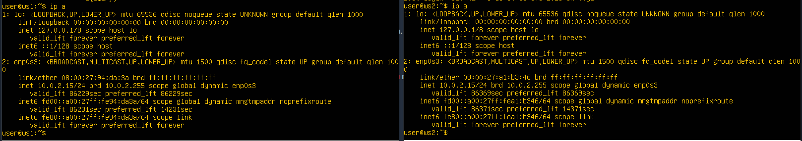

*Изменённые файлы netplan и их apply на обоих ВМ*

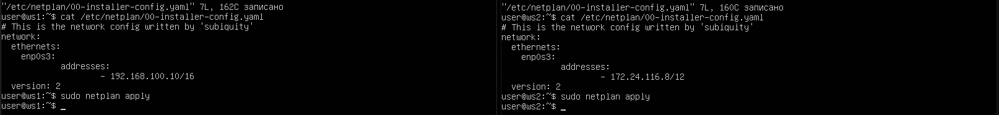

**Part 2.1**

*Добавление статических маршрутов и их ping на обоих ВМ*

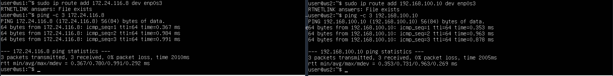

*Содержимое изменённых netplan и ping обоих ВМ друг друга*

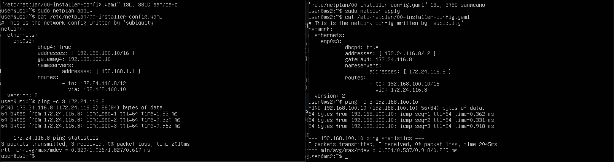
## Task 3

**Part 3.1**
- 8 Mbps = 1 MB/s
- 100 MB/s = 800 000 Kbps
- 1 Gbps = 1 000 Mbps

**Part 3.2**

*Вывод команд iperf3 на ВМ-сервер и ВМ-клиент*

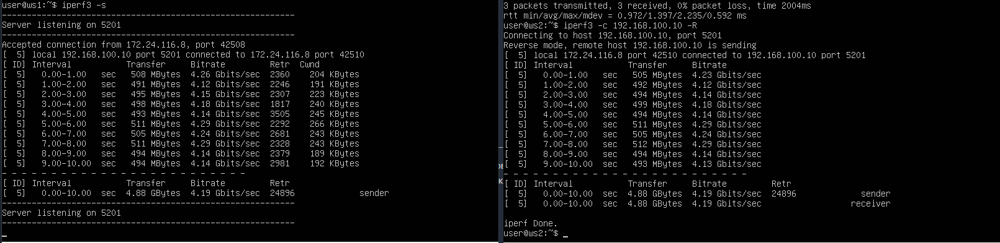

- 4.19 Gbits/s

## Task 4

**Part 4.1**

*Запуск, содержимое файлов firewall.sh на обоих ВМ и их тестовый ping друг друга*

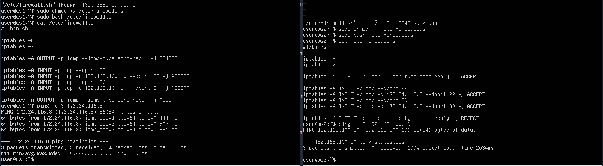

- Разница между стратегиями: для того, чтобы одна машина пинговалась, а вторая нет, не обязательно писать обе строки, так как правила обрабатываются в порядке их написания

**Part 4.2**

*ping друг друга и себя на обоих ВМ для выяснения которая не пингуется *

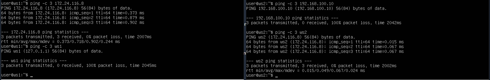

*nmap ВМ ws-1 на обоих ВМ*

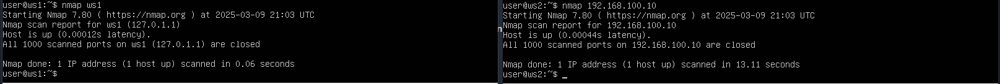

## Task 5

**Part 5.1**

*файл netplan на ВМ ws11*

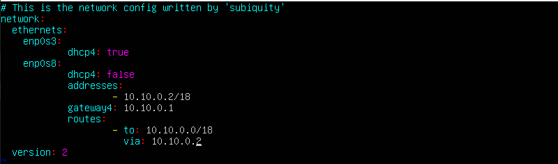

*файл netplan на ВМ ws21*

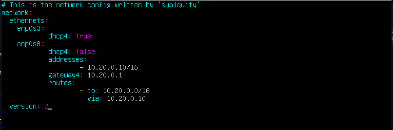

*файл netplan на ВМ ws22*

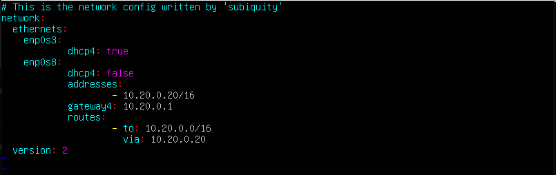

*файл netplan на ВМ r1*

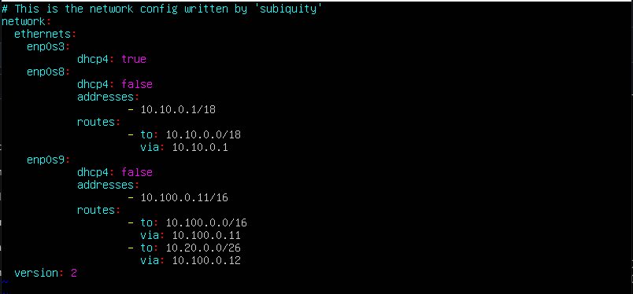

*файл netplan на ВМ r2*

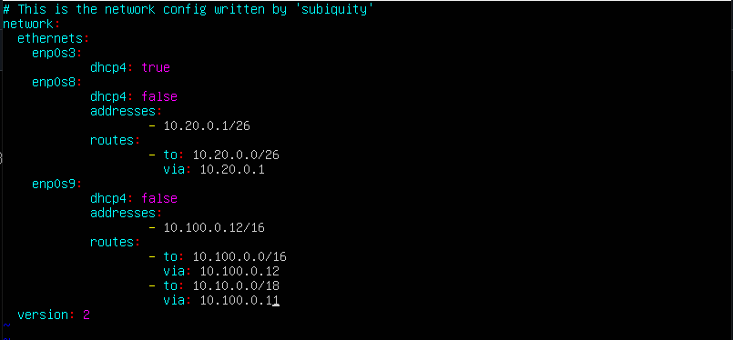

*"ip -4 a" на ВМ ws11*

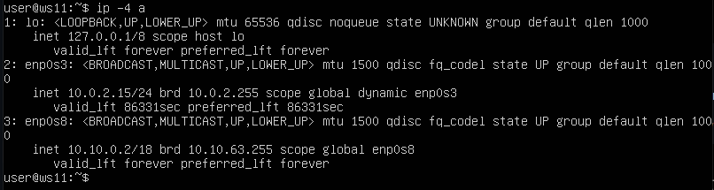

*"ip -4 a" на ВМ ws21*

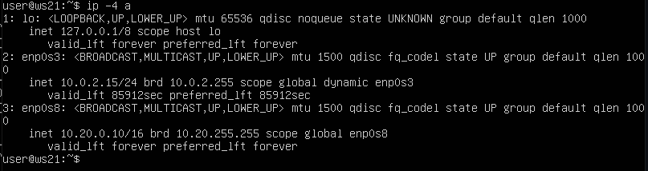

*"ip -4 a" на ВМ ws22*

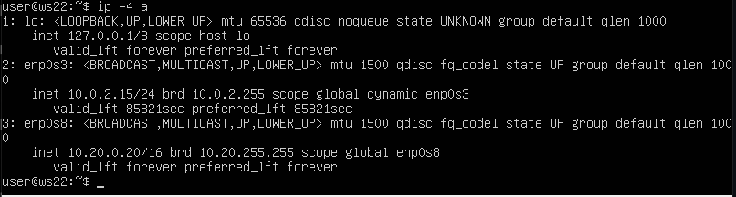

*"ip -4 a" на ВМ r1*

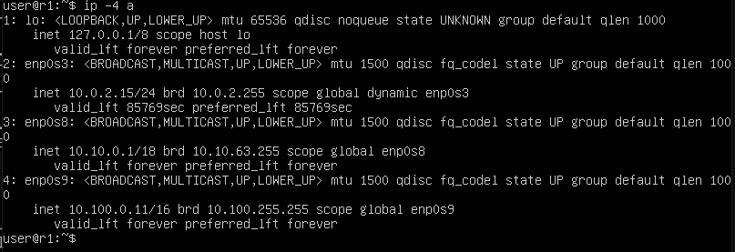

*"ip -4 a" на ВМ r2*

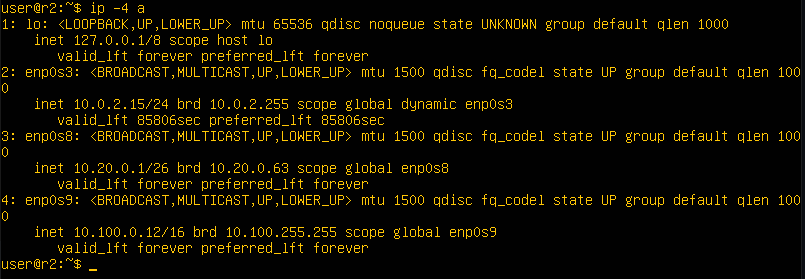

*ping ws22 с ws21*

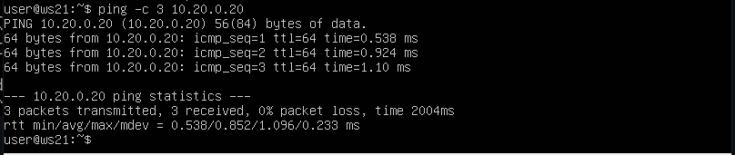

*ping r1 с ws11*

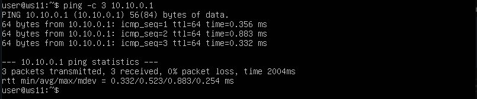

**Part 5.2**

*Включение переадресации на роутерах r1 и r2*

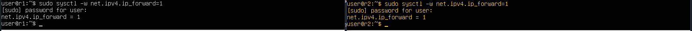

*Изменение файла /etc/sysctl.conf на роутерах r1 и r2*

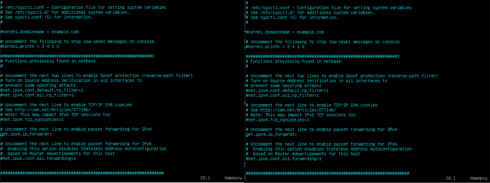

**Part 5.3**

*Добавление маршрута по-умолчанию на ws11*

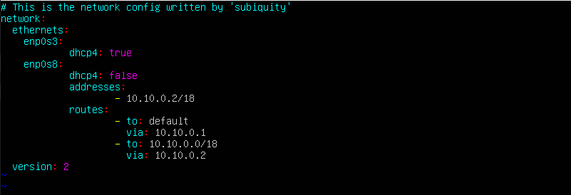

*Добавление маршрута по-умолчанию на ws21*

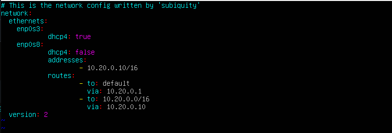

*Добавление маршрута по-умолчанию на ws22*

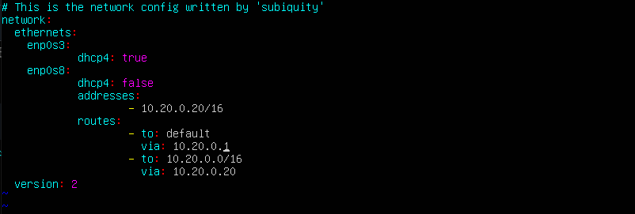

*Таблица маршрутизации ws11*

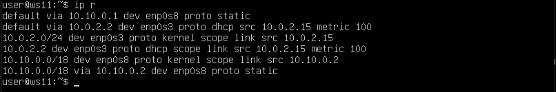

*Таблица маршрутизации ws21*

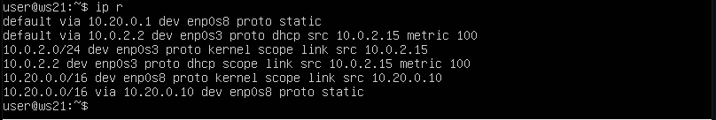

*Таблица маршрутизации ws22*

*ping r2 с ws11*

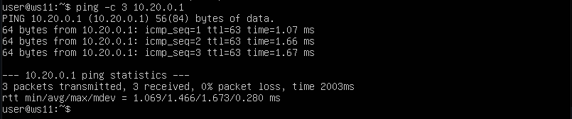

*Подтверждение ping от ws11 на r2*

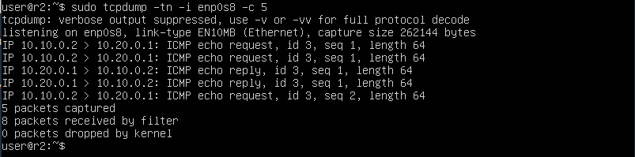

**Part 5.4**

*Статические маршруты на роутерах r1 и r2*

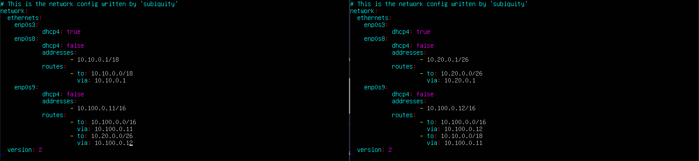

*Таблицы маршрутизации на роутерах r1 и r2*

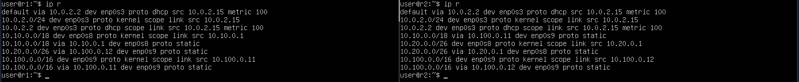

*Вызов "ip r list" на ws11 для 10.10.0/\[маска сети] и 0.0.0.0/0*

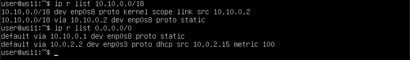

- IP-адрес 0.0.0.0 означает «эта сеть», но для использования в традиционном смысле этот адрес непригоден. Это похоже на ссылку: «Вставьте сюда адрес», или, в зависимости от контекста, «без конкретного адреса назначения». Он действует как резервный, пока не будет назначен действительный маршрутизируемый IP-адрес. Вариант использования IP-адреса 0.0.0.0 в качестве статического маршрута по умолчанию означает, что в таблице маршрутизации не указан конкретный адрес в качестве следующего перехода на пути пакета к его конечному получателю. Когда маршрут по умолчанию используется с маской подсети 0.0.0.0, он соответствует любому адресу.

**Part 5.5**

*Вывод команды tcpdump на r1*

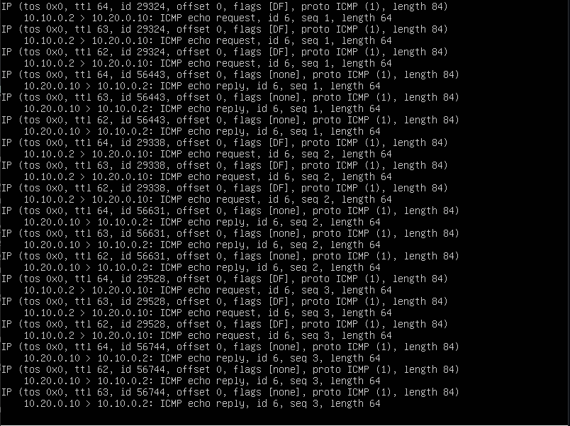

*Вывод команды traceroute на ws11*

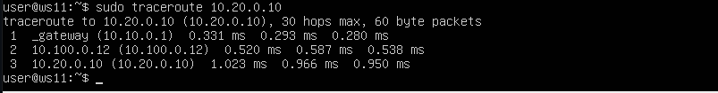

- Команда traceroute linux использует UDP пакеты. Она отправляет пакет с TTL=1 и смотрит адрес ответившего узла, дальше TTL=2, TTL=3 и так пока не достигнет цели. Каждый раз отправляется по три пакета и для каждого из них измеряется время прохождения. Когда утилита traceroute получает сообщение от целевого узла о том, что порт недоступен трассировка считается завершенной.

**Part 5.6**

*Перехват трафика на r1*

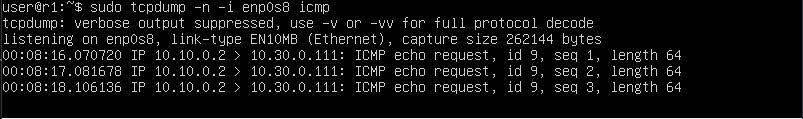

*ping несуществующего ip с ws11*

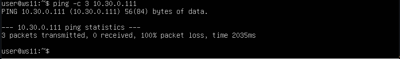

## Task 6

*Настройка файла dhcpd.conf на r2*

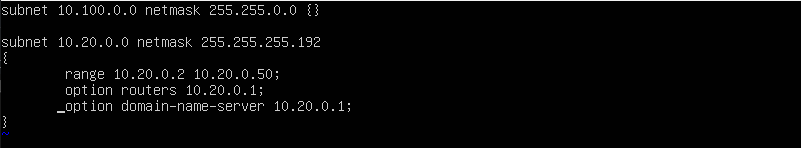

*Добавление в файл /etc/resolv.conf строки "nameserver 8.8.8.8"*

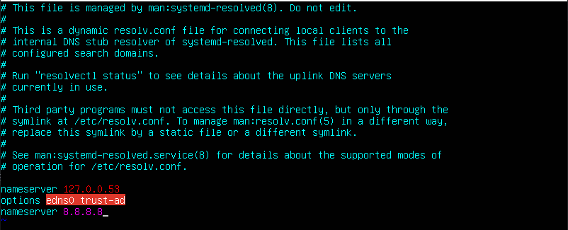

*Перезагрузка службы DHCP*

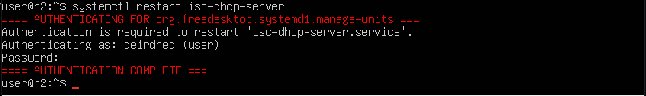

*"ip a" на ws21*

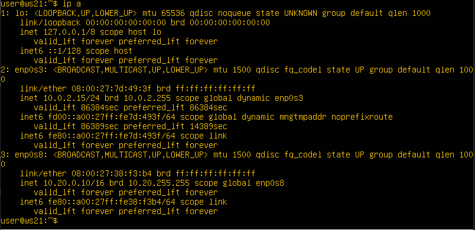

*ping ws22 с ws 21*

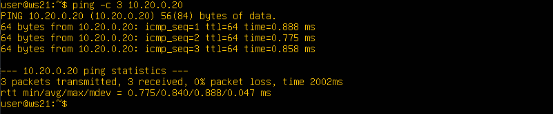

*Указание MAC-адреса для ws11*

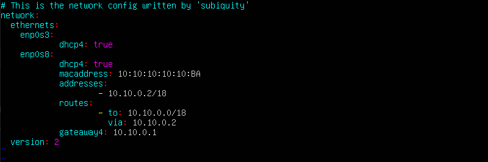

*Настройка dhcpd.conf на r1*

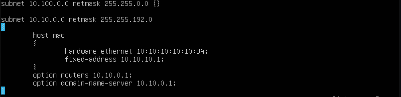

*Добавление в файл /etc/resolv.conf строки "nameserver 8.8.8.8"*

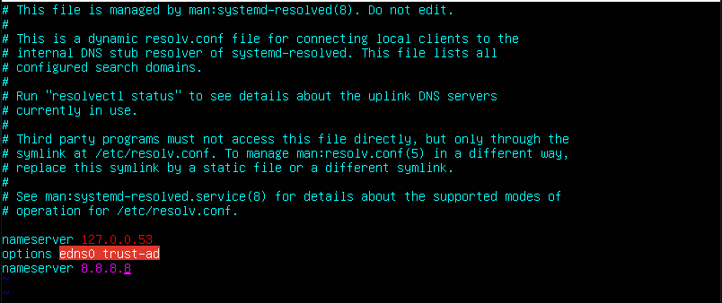

*Перезагрузка службы DHCP*

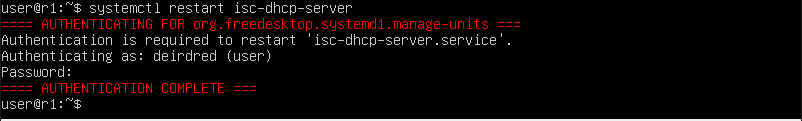

*"ip a" на ws21*

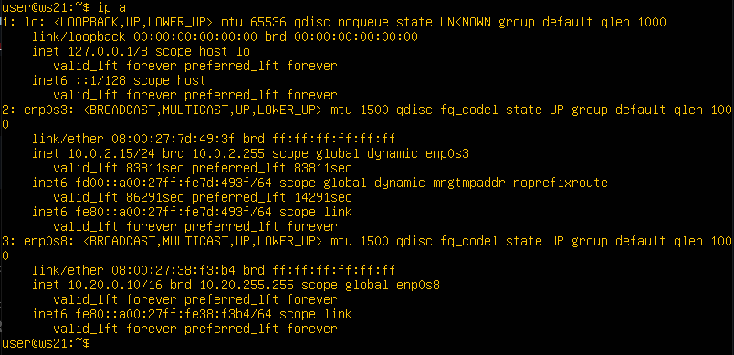

*Освобождение ip и запрос нового у DHCP*

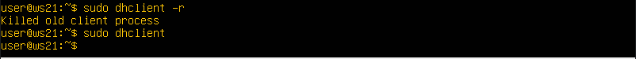

*"ip a" на ws21 после запроса нового ip*

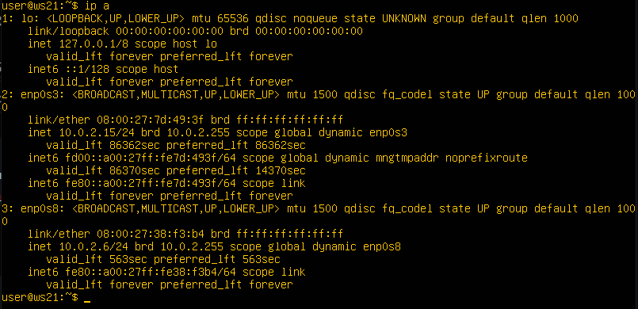

- Настройка конфигурации службы DHCP (адрес маршрутизатора по-умолчанию, DNS-сервер, адрес внутренней сети, привязка к MAC-адресу)
- Клиент протокола динамической конфигурации хоста (команда dhclient) для обновления или освобождения IP-адреса

## Task 7

*"Изменения в файле /etc/apache2/ports.conf на ws22 и r1*

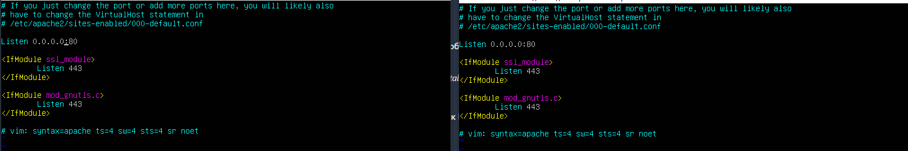

*Запуск веб-сервера Apache на ws22 и r1*

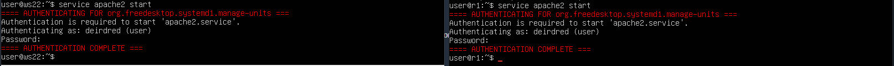

*Настройка firewall на r2*

*ping ws22 и r1*

*Изменения firewall r2*

*Добавление правил в firewall r2*

*Проверка соединения через telnet*

